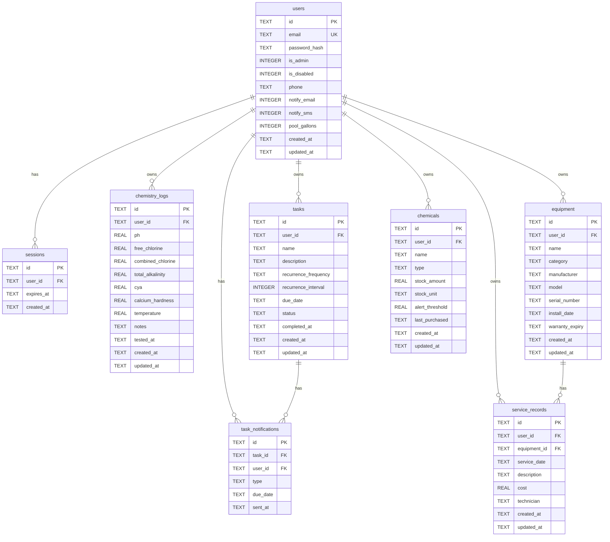

# Architecture

PoolVibes follows Domain-Driven Design (DDD) with a layered architecture. Dependencies point inward — outer layers depend on inner layers, never the reverse.

## Layers

```
┌─────────────────────────────────────┐
│           Interface (Web)           │  HTTP handlers, templates
├─────────────────────────────────────┤
│          Infrastructure             │  SQLite/PostgreSQL repos, DB connection
├─────────────────────────────────────┤
│           Application               │  Commands, services
├─────────────────────────────────────┤
│             Domain                  │  Entities, value objects, repo interfaces
└─────────────────────────────────────┘
```

### Domain

Pure business logic with no external dependencies. Contains:

- **Entities** — `User`, `Session`, `ChemistryLog`, `Task`, `TaskNotification`, `Equipment`, `ServiceRecord`, `Chemical` with validation rules and business methods
- **Value Objects** — `Recurrence` (frequency + interval with next-due-date calculation), `Quantity` (amount + unit)
- **Repository Interfaces** — Abstractions that infrastructure implements

### Application

Orchestrates domain logic through:

- **Commands** — CRUD command structs (DTOs) for each feature
- **Services** — Business logic coordination (auth, user management, auto-rescheduling tasks on completion, stock adjustment validation, notification scheduling)
- **Context Helpers** — `WithUser`/`UserFromContext` for propagating the authenticated user

### Infrastructure

External concerns:

- **Database Repositories** — SQLite and PostgreSQL implementations of domain repository interfaces
- **Connection** — Database connection management, migration runner (per driver)
- **Migrations** — SQL files embedded in the binary via Go's `embed` package, with separate migration sets for SQLite and PostgreSQL
- **Notifiers** — Resend (email) and Twilio (SMS) implementations of the `Notifier` interface

### Interface

User-facing layer:

- **HTTP Server** — Go `http.ServeMux` with method-based routing (`GET /tasks`, `POST /tasks`, etc.)
- **Middleware** — `requireAuth` (session cookie → user context), `requireAdmin` (admin check)
- **Handlers** — SSE handlers using Datastar for reactive UI updates; standalone HTML auth pages
- **Templates** — [templ](https://templ.guide) components compiled to Go code (type-safe, with syntax highlighting and auto-escaping)

## Directory Structure

```
poolvibes/
├── main.go                          # Entrypoint, embeds migrations
├── cmd/
│   ├── root.go                      # Cobra root command, Viper config
│   └── serve.go                     # Serve command, wires all layers
├── migrations/
│   ├── sqlite/                      # SQLite migrations (embedded)
│   └── postgres/                    # PostgreSQL migrations (embedded)
└── internal/
    ├── domain/
    │   ├── entities/                # ChemistryLog, Task, Equipment, ServiceRecord, Chemical
    │   ├── valueobjects/            # Recurrence, Quantity
    │   └── repositories/            # Interfaces
    ├── application/
    │   ├── command/                 # CRUD command structs
    │   └── services/                # Business logic
    ├── infrastructure/
    │   ├── db/
    │   │   ├── sqlite/              # SQLite repos + connection
    │   │   └── postgres/            # PostgreSQL repos + connection
    │   └── notify/                  # Email (Resend) and SMS (Twilio) notifiers
    └── interface/
        └── web/
            ├── server.go            # HTTP server + routes
            ├── handlers/            # SSE handlers per feature
            └── templates/           # templ components (*.templ + generated *_templ.go)
```

## Database Schema



## Tech Stack

| Component | Choice | Rationale |
|-----------|--------|-----------|
| Router | `http.ServeMux` | Go 1.22+ method routing, no external dependency |
| Frontend | Datastar | SSE-driven reactive UI, no JavaScript framework |
| Templates | templ | Type-safe HTML templates compiled to Go |
| CSS | Bulma 1.0.4 | Lightweight, CDN-hosted |
| Database | modernc.org/sqlite (default), pgx (PostgreSQL) | SQLite: pure Go, no CGO; PostgreSQL: for hosted deployments |
| Migrations | golang-migrate | Embedded SQL files, auto-run on startup |
| CLI | Cobra + Viper | Standard Go CLI pattern |

## Request Flow

1. Browser sends request (or Datastar sends SSE request via `data-*` attributes)
2. Auth middleware checks session cookie, loads user into context
3. `http.ServeMux` routes to the appropriate handler
4. Handler parses the request into a command struct
5. Service extracts user ID from context, validates and executes business logic via repository interfaces
6. Database repository (SQLite or PostgreSQL) performs the operation (scoped to user)
7. Handler sends SSE response back, patching the UI via Datastar
